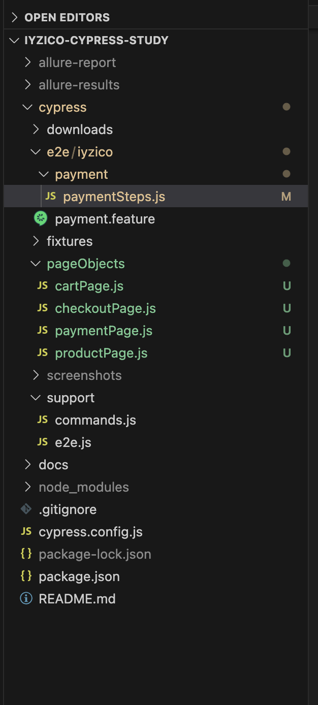

  
  &nbsp;&nbsp;&nbsp;&nbsp;&nbsp;
  

  
  
  
  
  
  

<h1 align="center">Iyzico Cypress E2E Test Projesi</h1>

## 📂 İçindekiler

- [📘 Proje Açıklamasi](#proje-aciklamasi)
- [✅ Kurulum](#-kurulum)
- [✅ Komutlar](#-komutlar)
- [✅ Test Senaryoları](#-test-senaryolari)
- [📊 Raporlama – Allure Reporter](#raporlama-allure-reporter)
- [📁 Proje Klasör Yapısı](#proje-klasör-yapisi)
- [📚 Kaynaklar](#-kaynaklar)
- [🙏 Teşekkürler](#-teşekkürler)

## 📘 Proje Açıklaması

Bu proje, [Iyzico](https://www.iyzico.com/demo/) demo ödeme sayfası üzerinde uçtan uca (end-to-end) testlerin **Cypress** test otomasyon aracı kullanılarak yazılmasını amaçlamaktadır.

Proje kapsamında iki farklı ödeme senaryosu test edilmektedir:

- Kayıtlı bir kredi kartı ile ödeme yapma
- Yeni bir test kartı ile ödeme yapma

Ayrıca, **Cucumber (Gherkin)** formatı kullanılarak davranışa dayalı senaryolar yazılmıştır, senaryolar **etiket (tag)** desteğiyle gruplandırılmıştır ve **Allure Reporter** entegrasyonu ile görsel test raporları oluşturulmuştur.

## 📁 Kurulum

1️⃣ Node.js ve NPM

Öncelikle sisteminde Node.js yüklü olmalıdır. Kontrol için;

      node -v
      npm -v

---
2️⃣ Projeyi Klonla ve Bağımlılıkları Kur

git clone https://github.com/melihberk/iyzico-cypress-study.git

cd iyzico-cypress-study

npm install
---
3️⃣ Cypress ve Gherkin Kütüphaneleri

.feature dosyalarının koşturulabilmesi için bu yapı zorunludur.

npm install --save-dev cypress

npm install --save-dev @badeball/cypress-cucumber-preprocessor

npm install --save-dev @bahmutov/cypress-esbuild-preprocessor

---
4️⃣ Tag Bazlı Test Çalıştırma

Senaryoları tag kullanarak koşmak için şu paketi yükle:

npm install --save-dev cypress-tags
---
5️⃣ Önerilen VSCode Eklentileri

Cucumber (Gherkin) Full Support >
.feature dosyaları için sözdizimi renklendirme ve adım tanıma

Cypress Snippets >
Cypress komutlarını otomatik tamamlama

Prettier Code Formatter >
Kod biçimlendirme ve okunabilirlik

## 📁 Komutlar

Aşağıda projeyi başlatmak ve testleri çalıştırmak için tanımlanmış npm komutları ve açıklamaları yer almaktadır.

### 📜 package.json içindeki scripts:

npm run cy:open > Cypress GUI arayüzünü açar. Testleri görsel olarak çalıştırabilirsiniz.

npm run cy:tests > Tüm testleri headless modda terminal üzerinden çalıştırır.

npm run browser:chrome:tag > Belirli tag’e sahip senaryoları Chrome’da çalıştırır. Allure raporu da oluşturulur.

npm run report:allure > allure-results klasöründen test sonuçlarını alır, allure-report dizinine rapor oluşturur ve tarayıcıda açar.

## 📁 Test Senaryolari

Projede, Iyzico demo sayfası üzerinden iki farklı ödeme tipi için test senaryoları yazılmıştır.  
Bu senaryolara `cypress/e2e/iyzico/payment.feature` dosyasından ulaşabilirsiniz.

### 📌 Kullanılan Ödeme Tipleri

- **Kayıtlı kredi kartı ile ödeme**
- **Test kredi kartı ile “İyzico ile Öde” seçeneği üzerinden ödeme**

---

### 💳 Test Kartı Bilgileri

Test kartı bilgileri ve gerekli doğrulama kodları, Iyzico tarafından sağlanan demo ortamdan alınmıştır:

- Kart Numarası: `5892830000000000`
- Son Kullanma Tarihi: `12/30`
- CVC: `540`
- Kart Sahibi: `MELİH BERK`
- 3D Doğrulama Kodu: `123456`
- SMS Doğrulama Kodu: `283126` *(Bazı senaryolarda ek 3D ekran açılabilir)*

🔗 Daha fazla bilgi için: [Iyzico Demo Sayfası](https://www.iyzico.com/demo)

🔗 Daha fazla test kartı için: [Iyzico Test Kartları](https://docs.iyzico.com/ek-bilgiler/test-kartlari)

---

### 🧠 Step Definition'da Kullanılan Cypress Metotları

Test adımlarını tanımlarken aşağıdaki Cypress komutları ve yapıları kullanılmıştır:

- `cy.get()` → Sayfa üzerinde element seçimi yapmak için  
- `cy.contains()` → İçeriğe göre element bulmak için  
- `cy.origin()` → Farklı domain (örneğin 3D secure iframe) içindeki işlemler için  
- `cy.click()` → Buton veya link tıklamak için  
- `cy.type()` → Input alanlarına veri girişi yapmak için  
- `cy.wait()` → Zaman bazlı beklemeler  
- `if / else` → Akış kontrolü için bazı step’lerde koşullu yapılar  
- `eq()` → Seçilen element listesinden belirli index’i almak için

Tüm adımlar `cypress/e2e/iyzico/paymentSteps.js` dosyasında tanımlanmıştır.

## 📊 Raporlama – Allure Reporter

Projede test sonuçlarını detaylı ve görsel olarak inceleyebilmek için **Allure Reporter** entegrasyonu kullanılmıştır.

- **Allure CLI Kurulumu (global):** npm install -g allure-commandline --save-de

- **Eğer yetki hatası alırsan (Mac/Linux):** sudo npm install -g allure-commandline --unsafe-perm=true

- **Cypress Allure Plugin Kurulumu:** npm install --save-dev @shelex/cypress-allure-plugin
- **cypress.config.js dosyasına şu satırları ekle:** 

const allureWriter = require('@shelex/cypress-allure-plugin/writer');
allureWriter(on, config);

- **support/e2e.js dosyasına ekle:** import '@shelex/cypress-allure-plugin';

### 🚀 Allure İlgili Komutlar

Aşağıdaki komutlarla hem testleri belirli tag’lerle çalıştırabilir, hem de Allure raporunu oluşturup açabilirsin:

- **Tag’li test çalıştırma + Allure raporlama:**

npm run browser:chrome:tag

> Belirli tag’e sahip senaryoları Chrome’da çalıştırır.  
> `@payment` gibi bir tag verilmişse sadece o senaryolar çalıştırılır.  
> Aynı zamanda `allure-results` klasörüne rapor çıktısı oluşturur.

---

- **Allure raporunu oluştur ve tarayıcıda aç:**

npm run report:allure

> `allure-results` klasöründen test sonuçlarını alır,  
> `allure-report` dizinine HTML raporu oluşturur ve varsayılan tarayıcıda açar.

### 🖼️ Allure Rapor Örneği

Aşağıda örnek bir Allure test raporu ekran görüntüsü yer almaktadır:

  

> Rapor sayesinde her test adımını, sürelerini, hata mesajlarını ve geçmiş çalışmaları kolayca analiz edebilirsiniz.

## 📁 Proje Klasör Yapısı

Proje, Cypress ve Cucumber mimarisine uygun olarak yapılandırılmıştır.  
Aşağıda klasör yapısı ve içerdiği dosyaların açıklamaları yer almaktadır:

### 📂 Klasör Açıklamaları

Aşağıda proje klasörlerinin ne işe yaradığını kısa ve anlaşılır şekilde bulabilirsiniz:

- `cypress/e2e/`  
  Tüm test senaryolarının ve step definition dosyalarının bulunduğu ana klasör.

- `cypress/e2e/iyzico/`  
  Iyzico’ya özel feature (senaryo) dosyalarının ve adımların (step definitions) tutulduğu alt klasör.

- `payment.feature`  
  Gherkin sözdizimiyle yazılmış ödeme senaryoları.

- `paymentSteps.js`  
  `payment.feature` içindeki adımların karşılık geldiği JavaScript fonksiyonları.

- `cypress/support/`  
  Global olarak tanımlanan destek dosyaları, örneğin Allure entegrasyonu veya özel komutlar.

- `e2e.js`  
  Test öncesi/sonrası ayarlar, plugin import’ları bu dosyada yapılır.

- `commands.js`  
  Özel Cypress komutları tanımlanacaksa bu dosyada yer alır.

- `allure-results/`  
  Test çalıştırmaları sonrası oluşan ham rapor verilerinin tutulduğu klasör. (Versiyon kontrolüne eklenmez.)

- `allure-report/`  
  Oluşturulan HTML tabanlı Allure raporlarının yer aldığı klasör.

- `cypress.config.js`  
  Cypress ayar dosyası. Plugin’ler, test dizinleri, time-out vb. burada yapılandırılır.

- `package.json`  
  Proje bağımlılıklarını, script’lerini ve metadata bilgisini barındırır.

- `README.md`  
  Bu dökümantasyon dosyası. Projeye ait kurulum, kullanım ve açıklamaları içerir.

## 📚 Kaynaklar

Projede kullanılan araçlar, ilham alınan içerikler ve geliştirici dokümantasyonları aşağıda listelenmiştir:

- 🧪 **Cypress Resmi Dokümantasyonu**  
  https://github.com/cypress-io/cypress  
  https://docs.cypress.io

- 🧩 **Cucumber + Cypress (BDD) Yaklaşımı**  
  https://medium.com/@melihberkk/cypress-ile-bdd-test-otomasyonu-9536201e5b07

- 🎥 **Cypress Test Eğitimleri – Codenbox Automation Lab (YouTube)**  
  https://www.youtube.com/@CodenboxAutomationLab

- 🖥️ **Allure Report Plugin (Shelex)**  
  https://github.com/Shelex/cypress-allure-plugin

- 🧪 **Allure Commandline**  
  https://docs.qameta.io/allure/

- 💳 **Iyzico Demo ve Test Ortamı** *(isteğe bağlı)*  
  https://www.iyzico.com/demo  
  → Test kart bilgileri bu demo ortam üzerinden sağlanmıştır.

 >Bu kaynaklar, hem proje geliştirme sürecinde kullanıldı hem de yeni başlayanlar için referans niteliğindedir.
---

## 🙏 Teşekkürler
  
Geliştirme sürecinde destek sağlayan kaynak üreticilerine, test araçlarını geliştiren ekiplere ve özellikle Iyzico’nun demo ortamı sayesinde güvenli test senaryoları oluşturmamıza imkân tanıyan yapısına teşekkür ederim.

Bu projeyi geliştirirken hem teknik bilgi kazandım hem de BDD yaklaşımının gücünü daha yakından tanıma fırsatı buldum.  
Katkı sağlayan herkese ve ilham veren içerik üreticilerine içtenlikle teşekkür ederim.

 

**– Melih Berk**

